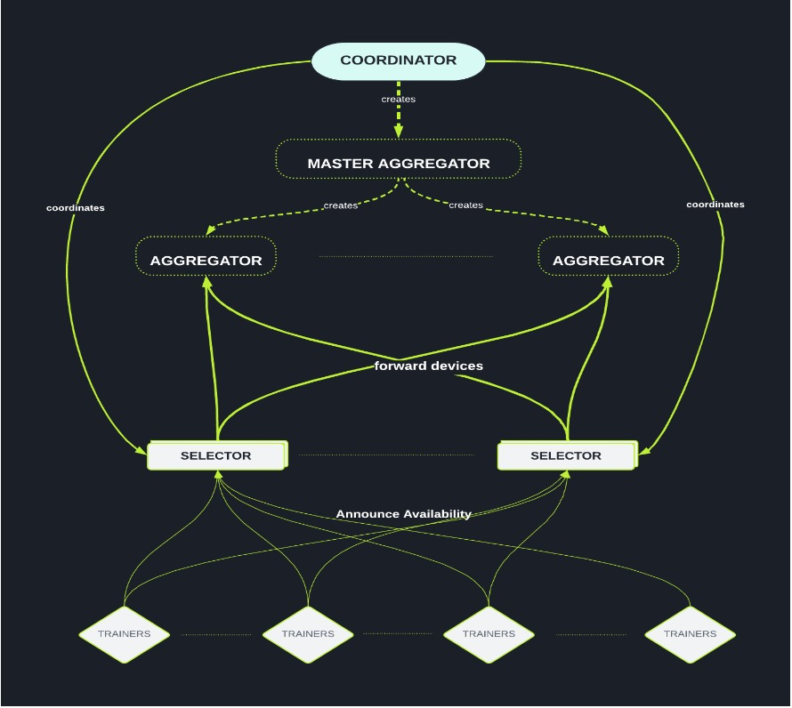
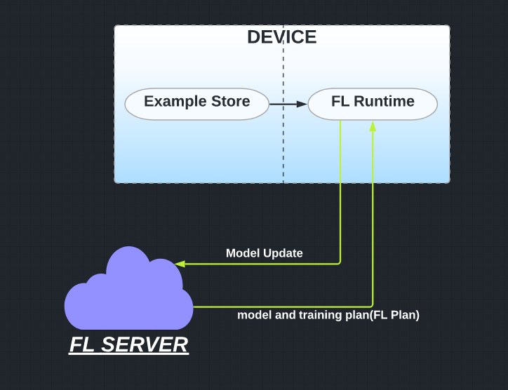

# Federated Learning: System Design

In this project, i designed a distributed and decentralized system for Federated Learning.

## Server-Side Architecture

FL Server is designed using the ```Actor Programming Model``` in Golang([Protoactor-Go](https://github.com/asynkron/protoactor-go)).The Actor Model provides a higher level of abstraction for writing concurrent and distributed systems.

Each actor handles a stream of messages/events strictly
sequentially, leading to a simple programming model. Using Actor Model, the application can be scaled easily.

The main actors in the server are:

* **Coordinator** -> These are the top level actors which manages the entire FL-Cycle. They receive message from the server to start FL Training Cycle. Each Coordinator actor manages its own FL Population.

* **Master-Aggregator** -> These are the actors which aggregates the results from the different aggregators. In order to scale with the number of devices, these actors make dynamic decision to spawn one or more **Aggregator**.

* **Aggregator** -> These actors are responsible for aggregating the results from the different devices.

* **Selector** -> Selectors are responsible for accepting and forwarding device connections to the appropriate aggregator. They communicate one-to-one with the Coordianator on how much devices are needed to perform a given FL-Task. After successful spawning of the **Master Aggregator** and **Aggregator**, the **Selector** forwards the connected devices to the aggregator.There can be multiple Selectors.



## Devices or Trainers

In actual implementation, the devices will be the edge devices on which the local model will be trained and asked for aggregation. For example, In Google Keyboard, the edge devices are the **mobile phones** on which the G-Board is downlaoded. 

In this architecture, the trainer functionality is also simulated using Actor Model. The trainers will be spawned dynamically and they will send their availability to the Selector actors.After successful spawn of Aggregators, these connected devices will be transferred to the respective Aggregators for model training.


## Instructions to run the code
```
go mod tidy
go build .
./fl_system
```

## Dependencies
* Go 1.18 (Preferred)
* ProtoActor-Go

### Test Cases

* Test Case checks if the FL System works correctly for different number of Devices Connections.
* Test Cases do  not execute the model.