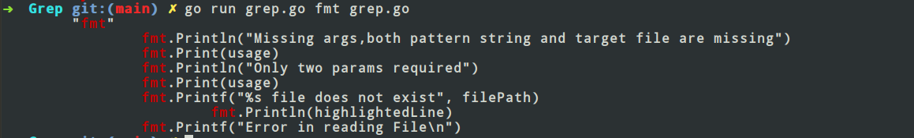

## Grepper in Golang

This is a grepper in Golang. You give it a file path and a pattern to search for and it will find out the relevant results.
I made this grepper just to learn Golang language.

## Instructions to run the code

```
go run grep.go [pattern] [file]
```

## Few Results

