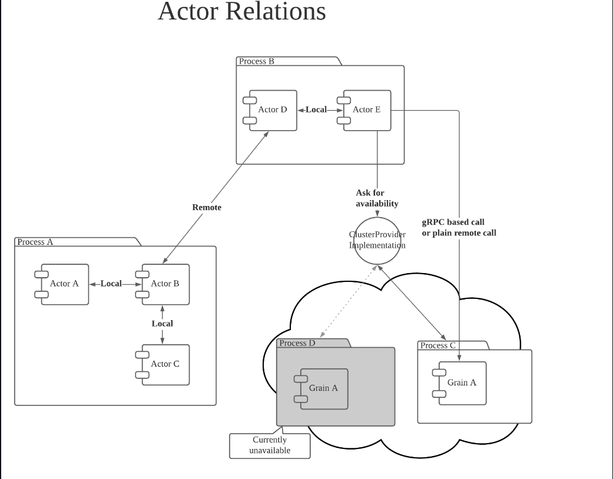

This contains some initial usage and implementation of ```Actor Model``` in Golang - [Protoactor-Go](https://github.com/asynkron/protoactor-go) 



# Local

For local message passing, see below directory:

* ```local-send``` -> Use Send() for local message passing. The recipient actor cannot refer to the sender actor.
* ```local-Request``` -> Use Request() for local message passing. The recipient actor can refer to the sender actor.
* ```local-Future``` -> Use RequestFuture() for local message passing. Context.Sender() does not return the PID of sender actor but that of actor.Future.

# Remote

* ```Remote/messages``` -> Contain Protobuf serializable message structures.
* ```remote/remote-request``` -> A process that sends message to pong actor by Request(). The recipient actor can refer to the sender actor.

# Supervision

This is a parent actor’s responsibility to take care of its child actor’s exceptional state. When a child actor can no longer control its state, based on the “let-it-crash” philosophy, child actor notifies such situation to parent actor by panic().

* ```Supervision/main.go``` -> This file implements a very basic supervision strategy for a parent to handle its child.

# Child Actor
Actor Model is a heirarchial model where parent actor is responsible for its child actors. Parent actor has control of its child actors.

* ```ChildActor/main.go``` -> This file implements a very basic child actor.

# References

* [[Golang] Protoactor-go 101: Introduction to golang's actor model implementation](https://blog.oklahome.net/2018/07/protoactor-go-introduction.html)
* [[Golang] Protoactor-go 101: How actors communicate with each other](https://blog.oklahome.net/2018/09/protoactor-go-messaging-protocol.html)